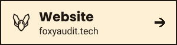
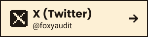
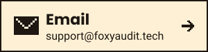

### An AI Runtime Auditing and Security Management System

**A developer tool for securing and auditing AI systems at runtime.**

 

## What is Foxy Audit?

Foxy Audit is a developer tool focused on **AI runtime security and auditing** — helping teams monitor, secure, and maintain accountability for AI systems as they operate in production.

### How it works

- **Hashed on your machine.** Foxy fingerprints each prompt and answer where it happens, then discards the text. Only the fingerprints and selected metadata leave your servers.
- **Sealed into a chain.** Each record is sealed to the one before it. Edit any past record and every record after it stops matching.
- **Proved anywhere.** Export the evidence, and your auditor can re-check it for themselves, without having to trust us.

Tamper-evident evidence, not a certification.

 

## Get in touch

